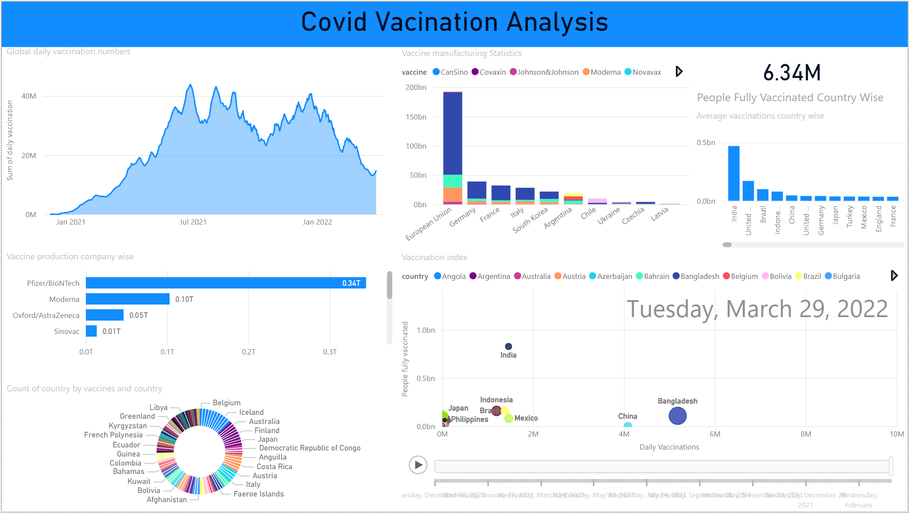

# 💉 Covid Vaccination Analysis Dashboard

[](https://opensource.org/licenses/MIT)
[](https://powerbi.microsoft.com/)
[](data/covid_vaccination.csv)
[]()
[]()
[]()

A comprehensive Power BI dashboard that provides detailed insights into global Covid-19 vaccination data. This interactive visualization tool helps analyze vaccination patterns, manufacturer distributions, country-wise progress, and daily vaccination trends.



## 📋 Table of Contents
- [Overview](#overview)
- [Key Features](#key-features)
- [Dashboard Components](#dashboard-components)
- [Dataset Description](#dataset-description)
- [Technical Implementation](#technical-implementation)
- [Installation](#installation)
- [File Structure](#file-structure)
- [Usage](#usage)
- [Key Insights](#key-insights)
- [Future Improvements](#future-improvements)
- [License](#license)

## 🎯 Overview

The Covid Vaccination Analysis Dashboard transforms complex vaccination data into actionable insights through detailed visualization and analysis of various metrics. It enables data-driven decision-making by providing comprehensive visualization of vaccination patterns, manufacturer distribution, and country-wise progress.

## ✨ Key Features

- 📈 Global Daily Vaccination Trends
- 🏭 Vaccine Manufacturing Statistics
- 🌍 Country-wise Vaccination Progress
- 💉 Vaccine Production Analysis
- 📊 Vaccination Index by Country
- 🗓️ Time Series Analysis
- 🏢 Manufacturer Distribution

## 📊 Dashboard Components

### 1. Vaccination Trends
- Global daily vaccination numbers
- Country-wise vaccination progress
- Time series visualization
- Peak vaccination tracking

### 2. Manufacturer Analysis
- Distribution by vaccine type
- Production statistics
- Company-wise manufacturing data
  - Pfizer/BioNTech
  - Moderna
  - Oxford/AstraZeneca
  - Sinovac

### 3. Geographic Analysis
- Country-wise vaccination rates
- Regional distribution
- Vaccination index by nation
- Population coverage metrics

### 4. Production Metrics
- Manufacturing statistics
- Vaccine type distribution
- Production capacity analysis
- Supply chain visualization

## 📚 Dataset Description

The dataset includes comprehensive vaccination records with the following metrics:

### 📋 Key Metrics
- 💉 Daily Vaccination Numbers
- 🏭 Manufacturing Statistics
- 🌍 Geographic Distribution
- 📊 Population Coverage
- 📅 Temporal Data

### Vaccine Types
- CanSino
- Covaxin
- Johnson&Johnson
- Moderna
- Novavax

## 🔧 Technical Implementation

### Interactive Features
- Time range selector
- Country filters
- Manufacturer filters
- Real-time metric updates

### Visualization Types
1. Area charts
2. Bar charts
3. Donut charts
4. Scatter plots
5. Cards
6. Line graphs

## 📥 Installation

```bash
# Download Power BI Desktop
# Clone this repository
git clone https://github.com/pouryare/covid-vaccination-dashboard.git
cd covid-vaccination-dashboard

# Open the .pbix file
# Connect to your data source
# Refresh the dashboard
```

## 📁 File Structure

```
📦 covid-vaccination-dashboard
 ┣ 📂 data/
 ┃ ┗ 📜 covid_vaccination.csv
 ┣ 📜 .gitattributes
 ┣ 📜 LICENSE
 ┣ 📜 README.md
 ┣ 📷 screenshot.png
 ┗ 📜 Covid Vaccination Analysis.pbix
```

## 🚀 Usage

1. Open the .pbix file in Power BI Desktop
2. Use the timeline to select date range
3. Filter by countries or regions
4. Analyze manufacturer distribution
5. Monitor vaccination trends
6. Track daily progress

## 🔍 Key Insights

1. **Global Trends**
   - Peak vaccination rate of ~40M daily doses
   - Declining trend in early 2022
   - Significant regional variations

2. **Manufacturer Distribution**
   - Pfizer/BioNTech leads production (0.34T)
   - Moderna follows with 0.10T
   - Diverse manufacturer ecosystem

3. **Geographic Analysis**
   - India leads in total vaccinations
   - European Union shows strong manufacturing capacity
   - Varied country-wise adoption rates

## 📈 Future Improvements

1. Add booster shot tracking
2. Implement variant analysis
3. Include demographic breakdown
4. Add vaccination effectiveness metrics
5. Enhance regional comparisons

## 📄 License

This project is licensed under the MIT License - see the [LICENSE](LICENSE) file for details.

Made with ❤️ by [Pourya](https://github.com/pouryare)

[](https://github.com/pouryare)